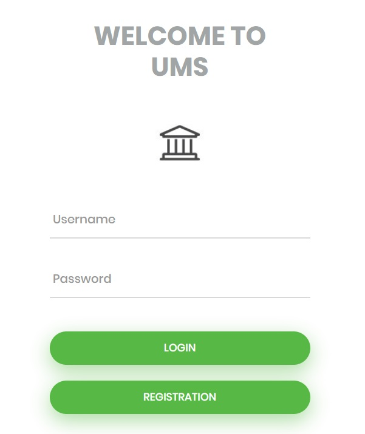
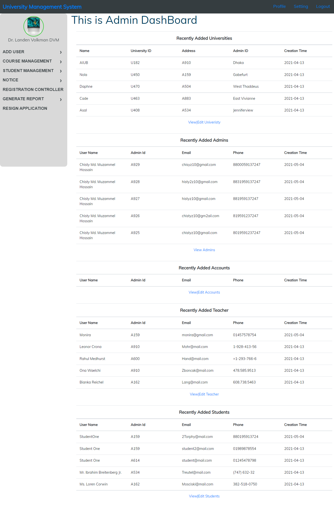
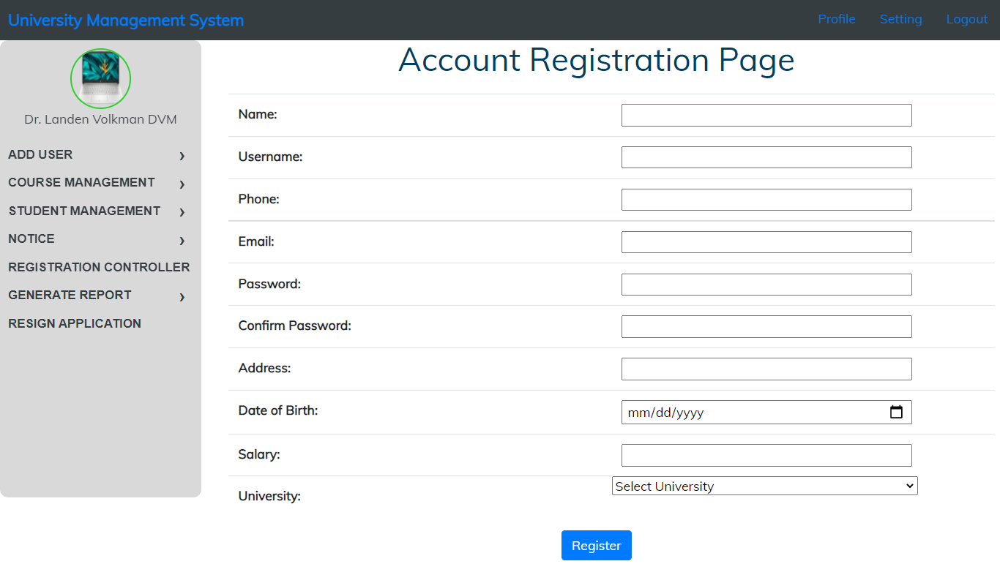
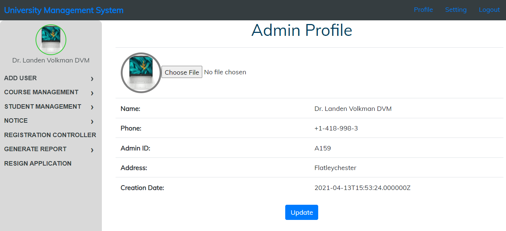
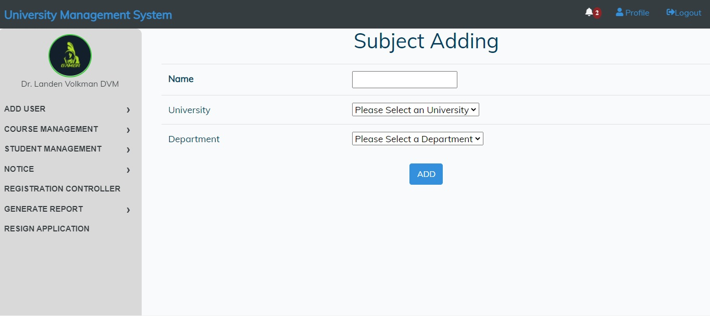
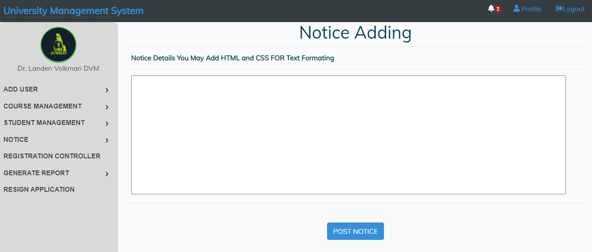
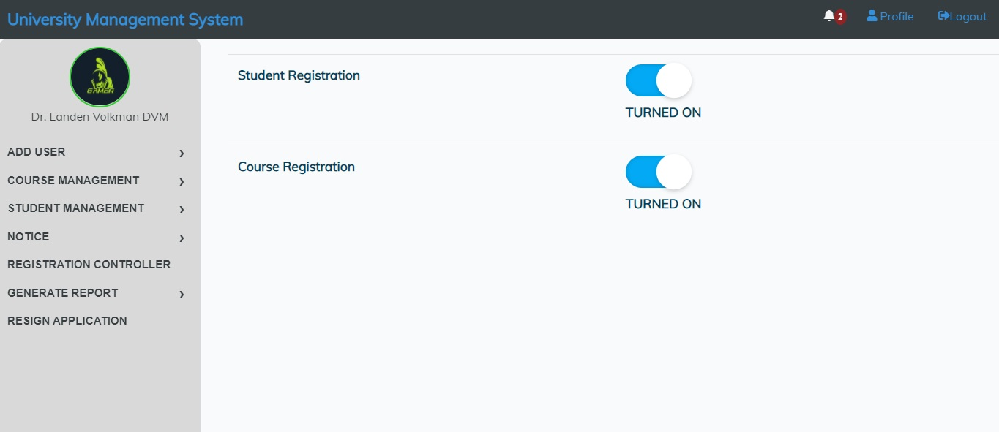
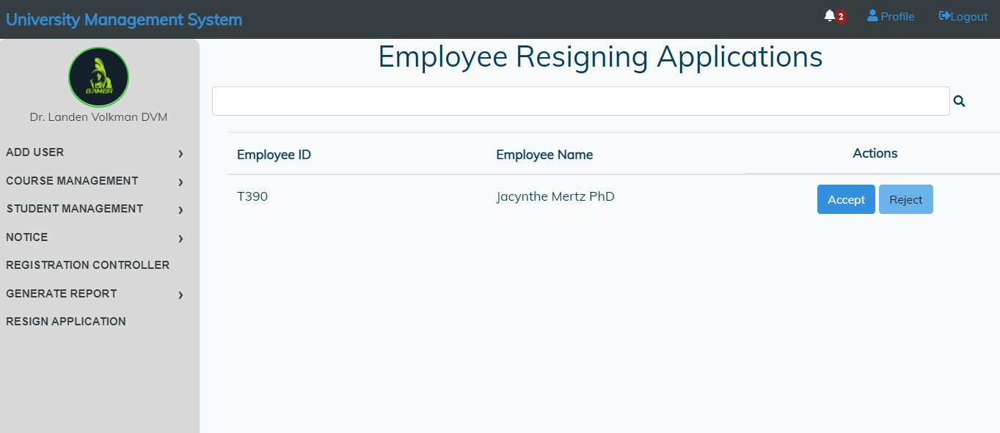
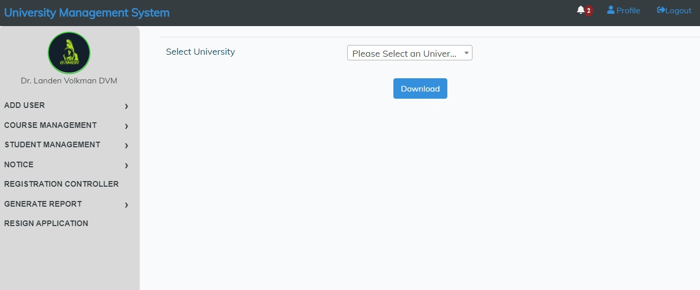
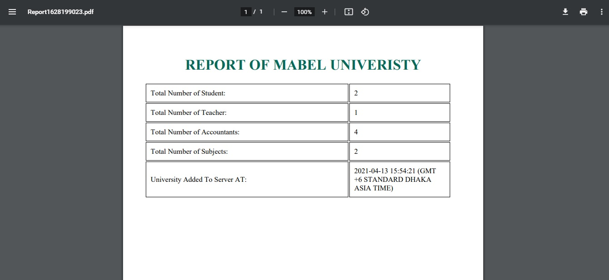

# University Management System Overview

The University Management System (UMS) is a comprehensive platform designed to streamline administrative, academic, and financial operations of an educational institution. It features multiple modules tailored for different users including Admins, Teachers, Students, and Accounts personnel, each equipped with specific functionalities to support their roles effectively.

## Common Features for All Users
- **Login**: Secure access to user-specific modules.
- **Home Page**: Dashboard overview of available features.
- **View Profile**: Access and view personal profile information.
- **Profile Manipulation**: Update personal information as necessary.

## Admin Module
- Manage university data including adding new entities like Universities, Teachers, Courses, Students, and Accounts Users.
- View and manage all users' information.
- Generate monthly reports for each university.
- Handle notes uploads/deletions, announcements, and activity monitoring.
- Control student registration and course registration phases.
- Maintain employee attendance and manage university finances including equipment costs, salary updates, and development expenses.

## Teacher Module
- Facilitate course materials management, including uploading or deleting notes and announcements.
- Manage course enrollment including adding or dropping students.
- Assign grades, assignments, and generate course-wise reports.
- View detailed student information and financial statuses.

## Student Module
- Engage in academic activities including registration applications, course viewing, and course registration.
- Access personal academic reports, scholarship applications, and financial transactions.
- Interact with academic schedules, notifications, and library services.
- Submit assignments and download necessary academic files.

## Accounts Module
- Oversee financial aspects including managing account balances for teachers and students.
- Assign and edit course fees, generate student fee statements, and manage financial aid.
- Provide limited access to teacher and student information.
- Generate payment slips and handle account statuses (blocking/unblocking).
- Manage salary distributions for teachers and staff.
- Maintain records of university expenses and generate comprehensive financial reports.

This system is designed to facilitate seamless interaction between different stakeholders of the university, ensuring efficient management of academic, administrative, and financial tasks.

### Front-End and Backend Laravel

### MVC FOLLOWED

### LOGIN PAGE

### AdminDashboard

### Registration Page

### Profile

### Subject Adding Page

### Notice Adding Page

### Registration Control Page

### Resign Management Page

### Report Generation Page

### Sample Report in PDF

